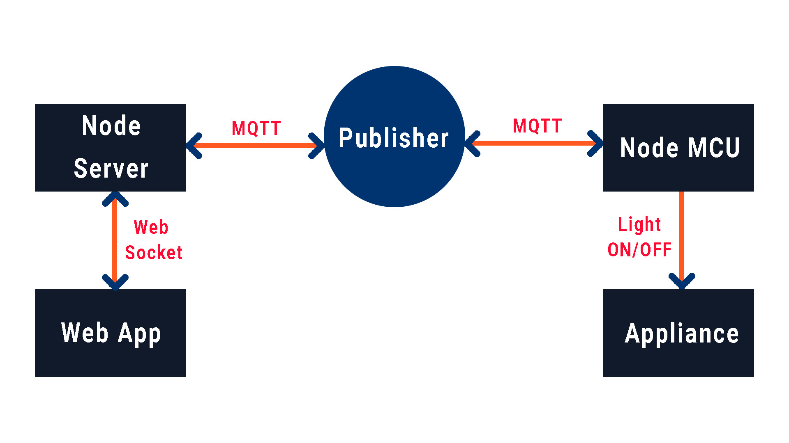
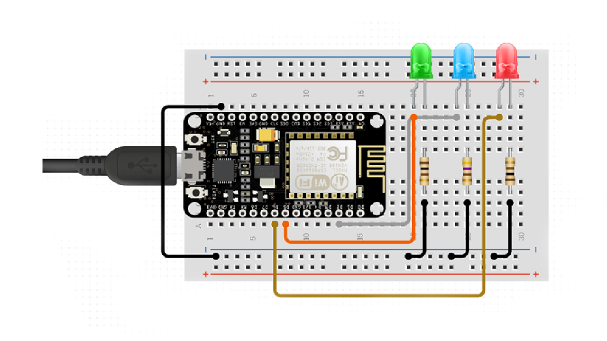
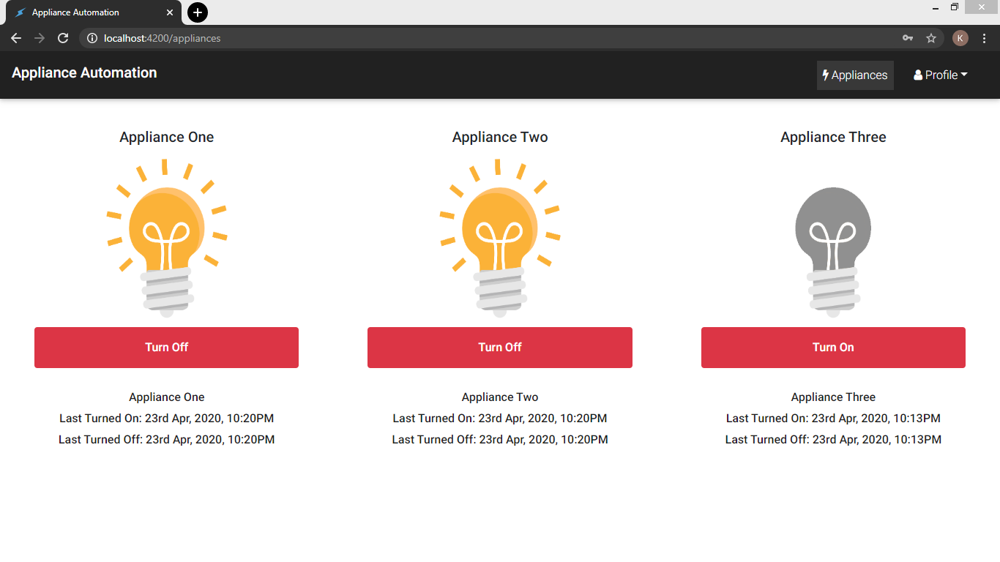
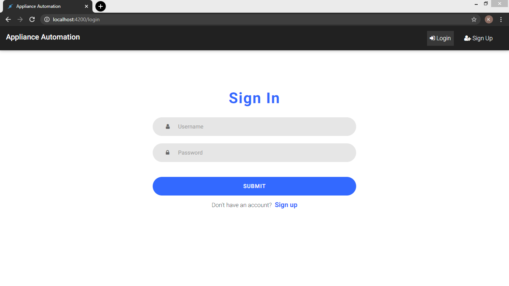
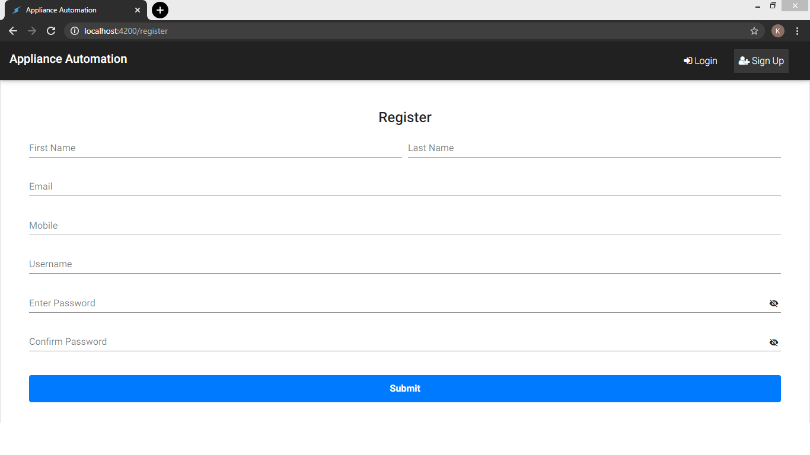

# IoT-Project-using-NodeMCU-MEAN-Stack

An IoT project demonstrating how we can control appliances (LEDs) connected to an NodeMCU (ESP8266) device over the internet using a MEAN stack web application.

### Tech
* MongoDB
* Express JS
* Angular
* Node JS
* Ardunio (.ino)

### Protocols
* MQTT
* Socket
* HTTP

### Working - Schematic Diagram
 

### Circuit Diagram of IoT Device
 

### Requirements for IoT Device
1. Node MCU
2. Three LED's
3. Three 220&#937; Resistors
4. Breadboard
5. Jumper Wires

### Appliances Page
On this page, you can control the LED's connected to the Node MCU.

 

### Sign In Page
 

### Registration Page
 

### Setup

1. Install this repository on your machine by downloading the zip file or running this command:

```
git clone https://github.com/KaranJagtiani/IoT-Application-using-MEAN-Stack.git
```

2. Run this command in "node-app" directory, as well as in the "angular-src" directory for installing the necessary node modules:

```
npm install
```

3. Add your broker service credentials in "app.js" and "nodemcu_sketch" files.  
Few free MQTT broker services - [Shiftr](https://www.shiftr.io/), [Hive MQ](https://www.hivemq.com/public-mqtt-broker/), [Mosquitto](https://mosquitto.org/).

4. Make sure you have an active internet connection, and add your WiFi credentials in "nodemcu_sketch" file.

5. Upload "nodemcu_sketch" to your Node MCU.

6. Make sure MongoDB is running:

```
mongod
```

### Usage

1. Run the Node server, by running this command in the node-app folder:

```
node app.js
```

2. To use the application, type this in your browser's URL field

```
http://localhost:3000/
```

### Have fun!
